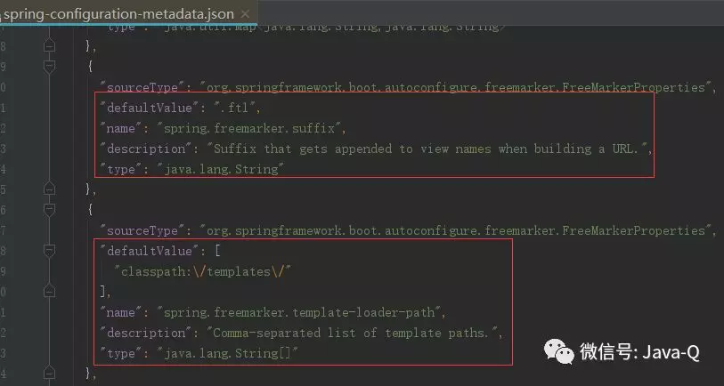
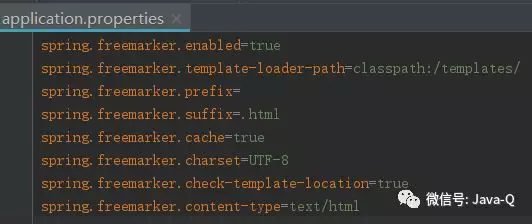

## 使用FreeMarker 进行Web开发

Spring MVC除了可以实现REST web服务之外，还可以使用它提供动态HTML内容。Spring MVC支持多种模板技术，包括Thymeleaf、FreeMarker和JSPs。
另外，许多其他的模板引擎也包括他们自己与Spring MVC的集成使用。Spring Boot支持以下模板引擎的自动配置：
* FreeMarker
* Groovy
* Thymeleaf
* Mustache

需要注意的是，虽然Spring MVC支持JSP，但是Spring Boot不建议使用JSP，因为在使用嵌入式servlet容器时，有一些使用限制。


在resources目录下新建application.properties：
```
spring.freemarker.suffix=.html
```

3.修改FreeMarker默认配置

通常不基于Spring Boot使用FreeMarker时，需要在应用上下文文件中配置如下bean及属性值：
```
<bean id="viewResolver" class="org.springframework.web.servlet.view.freemarker.FreeMarkerViewResolver">
    <property name="requestContextAttribute" value="ctp" />
    <property name="cache" value="true" />
    <property name="prefix" value="" />
    <property name="suffix" value=".html" />
    <property name="contentType" value="text/html;charset=UTF-8" />
</bean>
```

当基于Spring Boot使用FreeMarker时，上面的示例代码只在application.properties中配置了spring.freemarker.suffix=.html，
显然Spring Boot做了一些默认配置，通过在application.properties中重新配置覆盖了默认配置属性值。
查看源码可以看到Spring Boot做的一些默认配置： 



上图中Spring Boot默认配置模板文件的后缀是.ftl，而在application.properties中重新配置为.html。
示例代码将index.html存放在了templates目录下，这是因为Spring Boot配置的默认模板文件路径是templates。
Spring Boot默认配置的FreeMarker属性值都可以在spring-configuration-metadata.json中查找到，
这些默认值都可以在application.properties或application.yml中选择性重新配置。



