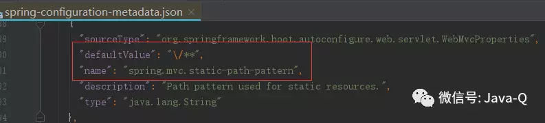

## 深入Spring Boot：静态资源使用详解

Web应用经常需要使用大量的静态资源，如图片、css、js等，Spring Boot对这些静态资源的使用提供了默认配置。
本篇将详细介绍如何使用默认配置和如何修改这些默认配置，主要包含以下5部分内容：

1. 静态资源存储路径；
2. 静态资源访问路径；
3. 最佳实践；
4. 应用欢迎页；
5. 应用图标。


#### 1.静态资源存储路径

默认配置下，使用Spring Boot可以将静态资源存储在/static或/public或/resources或/META-INF/resources目录下，
这四个目录的根目录都是classpath，具体在IDEA中位置如下图所示。 


上面的四个位置是Spring Boot读取静态资源的默认位置，使用spring.resources.static-locations属性配置这四个位置，
查看Spring Boot源码可以验证，具体代码如下所示。


当然也可以修改这个配置配置，通过在application.properties中配置spring.resources.static-locations属性，
属性值即是自定义的静态资源位置，例如自定义静态资源目录是classpath下的statics，具体配置如下：

```
spring.resources.static-locations=classpath:/statics
```

配置自定义静态资源存储目录后，默认的存储位置将不再生效。这个属性同样也可以配置在application.yml中。


#### 2.静态资源访问路径

默认配置下，可以通过/xxx访问静态资源，例如在/META-INF/resources目录下有boot.png，
使用默认8080端口启动应用后可以通过http://localhost:8080/boot.png访问这个图片。
这个默认配置是通过spring.mvc.static-path-pattern属性配置，查看源码可以验证，具体代码如下图所示。 




同样，这个默认访问路径也可以自定义，通过在application.properties中配置spring.mvc.static-path-pattern属性，
属性值即是静态资源访问路径前缀，例如自定义访问路径前缀是/image/，具体配置如下：

```
spring.mvc.static-path-pattern=/image/**
```

配置自定义静态资源访问路径后，默认的访问路径将不再生效。这个属性同样也可以配置在application.yml中。 


#### 3.最佳实践

如果你的应用程序被打包成一个jar，不要使用src/main/webapp目录。虽然这个目录是一个通用的标准，但是它只适用于war包，
如果您生成一个jar，它会被大多数的构建工具默默的忽略。所以，建议不要使用webapp目录结构。


#### 4.应用欢迎页

还记得Web应用启动后的默认欢迎页index.html吗？Spring Boot支持静态欢迎页和模板欢迎页，
应用启动会到/static或/public或/resources或/META-INF/resources目录下寻找index.html，如果自定义了静态资源存储路径，
那么就到自定义路径下寻找index.html。对这个index.html进行访问的时候，默认使用/index.html可以访问，
如果自定义了静态资源访问路径，那么就需要使用自定义静态资源访问路径，例如/image/index.html。如果找不到index.html，
将搜索index的模板文件，如果找到了，它将自动用作应用程序的欢迎页面。


#### 5.应用图标

使用浏览器访问Web服务的时候，网页标签的左上角会显示应用图标，这个图标的名称是favicon.ico，如果没有修改默认静态资源存储路径，
那么它可以存放在/static或/public或/resources或/META-INF/resources目录下，如果修改了，就需要存到自定义路径下。